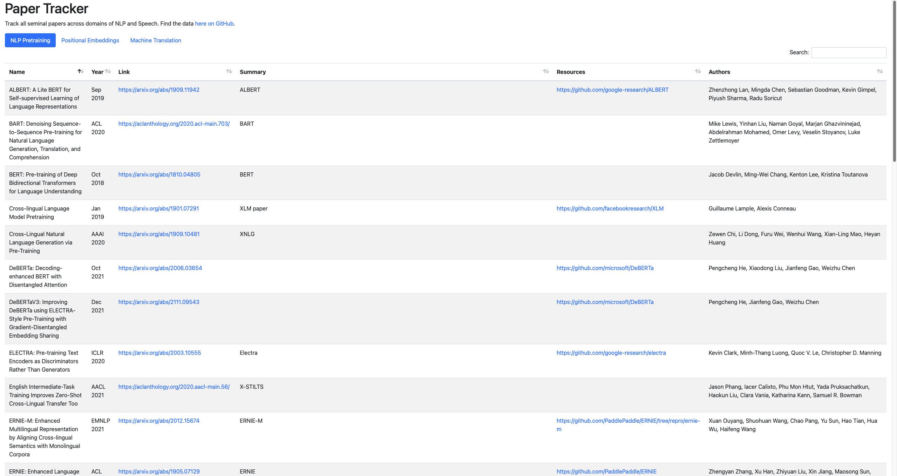

Paper Tracker 
=========================

## Motivation

Over the last few months we've [AI4Bharat](https://ai4bharat.org/) read many papers in differnt domains and found that the journey to learn a new topic is a long one. In many cases it is not easy to find a good paper to start with and sometimes we overlook good papers. I've found that keeping a tab of the all the papers we read, with a brief summary and all the resources available can help other leaners to navigate the new space much easier.

<!-- ## Preview

 -->

## Topics of Interest

- NLP Pretraining
- Automatic Speech Recogntion
- Machine Translation
- Prompting
- Probing
- Indic SNLP
- Datasets
- Evaluation Metrics

## Contributing

While the above topics are something that I'm personally interested in, I'm also interested in other topics that are not directly related to the above. I'm open to new contributions from fellow lerners on new topics below (but not limited to).

- Bias in NLP
- Natural Language Generation
- Speech-to-Speech Translation
- Model Interpretation

## Guidelines

- If you would like to suggest a paper to be added please submit the [google form](https://docs.google.com/forms/d/e/1FAIpQLSeUecDAb1O-BFhV2tcXzvQk_UpRP1yPyhkek5N6J3m9eEUUWA/viewform?usp=sf_link) with the required details.
- If you would like to add a new topics / a bunch of papers you can reach out to me on [mail](mailto:doddapaneni.sumanth@g,ail.com) or [twitter](https://twitter.com/sumanthd17)
- I would be happy if people who work on topics not listed here to take charge on leading the effort.
- I have some ideas on how to make the UI more user friendly. But given the my lack of experience I'm open to take any suggestions.